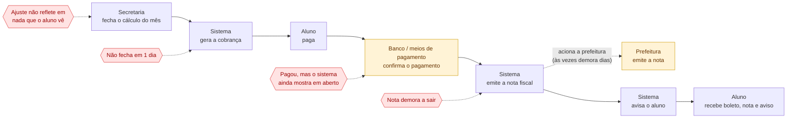

# Visão de negócio — situação atual (sem jargão técnico)

> Este diagrama é pra quem não é dev entender o problema: gestor, product
> owner, recrutador. Zero menção a Kafka, banco de dados, API. O desenho
> técnico equivalente é `01-arquitetura-atual.md`.

## Leitura
- 4 papéis, nenhum termo técnico: **Secretaria/Financeiro** (fecha o cálculo),
  **Sistema da faculdade** (processa), **Parceiros externos** (banco e
  prefeitura, fora do controle da faculdade), **Aluno** (paga e recebe).
- Os 4 problemas (PB1–PB4) aparecem nos mesmos pontos do desenho técnico —
  só que descritos em linguagem de negócio, não de sistema.
- Esse é o desenho pra abrir o artigo/post: qualquer leitor entende sem saber
  o que é fila, evento ou consumer.
