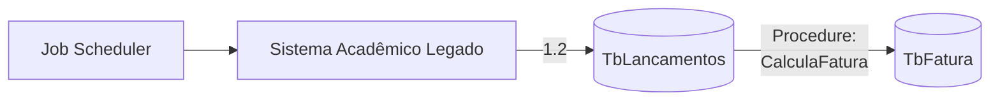
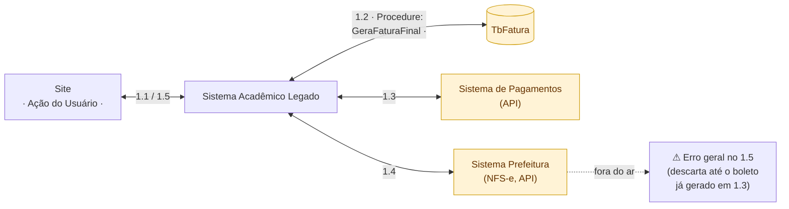

# Arquitetura atual — componentes técnicos

> Espelha `arquitetura-atual.drawio` (fonte oficial, editável). Dois fluxos:
> lote (batch) e sob demanda. Escopo fechado em **boleto** (PIX fica pra
> depois). Nomes reais de tabela/procedure.

## Fluxo 1 — Processamento em lote

- **1.1** — Job automático executa todo dia 1 e chama a procedure `CalculaFatura`.
- **1.2** — `CalculaFatura` executa todos os cálculos e salva na `TbFatura`.

## Fluxo 2 — Geração sob demanda (Site)

- **1.1** — Usuário vai ao site e clica em abrir fatura.
- **1.2** — Sistema Legado chama a procedure `GeraFaturaFinal` para o cálculo
  final (lê `TbFatura`) e retorna os valores.
- **1.3** — É chamada a API externa (Sistema de Pagamentos) pra gerar o
  boleto.
- **1.4** — Após a geração do boleto, é solicitada a emissão da nota fiscal
  (NFS-e) na Prefeitura.
- **1.5** — Sistema Legado retorna o resultado ao site.
- **Comportamento em caso de erro (decisão explícita, arquitetura real cheia
  de problemas):** se **1.4** falhar (prefeitura fora do ar), o processo
  inteiro retorna erro em **1.5** — **mesmo o boleto já gerado em 1.3 é
  descartado**. Um problema que não tem nada a ver com a prefeitura acaba
  falhando por causa dela.

## Componentes

| Componente | Papel | Problema |
|---|---|---|
| **Job Scheduler** | Dispara o processamento em lote, todo dia 1 | Gera o **P1** |
| **Site** (Ação do Usuário) | Aluno pede o boleto | Sofre o **P2** |
| **Sistema Acadêmico Legado** | Orquestra as duas procedures | — |
| **TbLancamentos** | Lançamentos que originam a fatura — lida pela `CalculaFatura` | Candidata a causa do **P1a** — a confirmar se também está sem expurgo |
| **Procedure CalculaFatura** | `TbLancamentos → TbFatura`. Roda 1x por ciclo, batch | Causa técnica do **P1b** |
| **TbFatura** (destacado) | Onde a fatura calculada fica. **Escrita** por `CalculaFatura`, **lida** por `GeraFaturaFinal` — recurso compartilhado entre as duas procedures | **P1a** e agravante do **P2** |
| **Procedure GeraFaturaFinal** | Lê `TbFatura`, orquestra a cadeia 1.3 → 1.4 | Causa técnica do **P2** |
| **Sistema de Pagamentos** (destacado) | API externa, gera o boleto (1.3) | Se cair, some com o boleto também |
| **Sistema Prefeitura / NFS-e** (destacado) | API externa, emite a nota fiscal (1.4) | Se cair, **derruba o boleto já gerado**, não só a nota |

## A leitura central deste diagrama

**TbFatura é o ponto de contato exato** entre as duas procedures: uma
escreve nela (`CalculaFatura`, 1x por ciclo), a outra lê dela
(`GeraFaturaFinal`, 1x por clique). É por isso que P1 e P2 compartilham a
mesma causa técnica — a tabela — mesmo sendo problemas sentidos de formas
diferentes.

**A segunda causa do P2, além da tabela:** `GeraFaturaFinal` encadeia duas
chamadas externas **síncronas** (1.3, pagamento; 1.4, NFS-e) dentro da mesma
execução, e uma falha em qualquer uma delas invalida o trabalho já feito.
Isso é acoplamento de verdade: o boleto, que não depende do governo, só
existe se o governo também responder.

## Pendências abertas

- **TbLancamentos também está sem expurgo, ou o volume grande está só em
  TbFatura?** Muda onde exatamente a P1a mora.
- Escopo fechado em **boleto** por enquanto — PIX e cartão ficam de fora
  deste diagrama até serem retomados.
