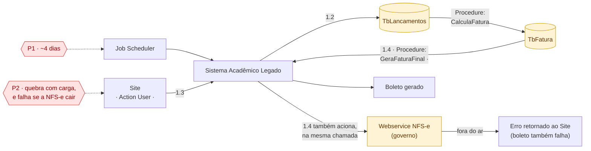

# Arquitetura atual — componentes técnicos

> Atualizado em 27/09 com o desenho do usuário: nomes reais de tabela e
> procedure, escopo fechado em **boleto** (PIX fica pra depois), e o detalhe
> de que a emissão da NFS-e roda **na mesma chamada** da geração do boleto —
> se o governo cai, o boleto cai junto.

## Componentes

| Componente | Papel | Problema |
|---|---|---|
| **Job Scheduler** | Dispara o processamento em lote | Gera o **P1** |
| **Site** (Action User) | Aluno pede o boleto | Sofre o **P2** |
| **Sistema Acadêmico Legado** | Orquestra as duas procedures | — |
| **TbLancamentos** (destacado) | Lançamentos que originam a fatura — lida pela `CalculaFatura`, linha a linha (RBAR) | Candidata a causa do **P1a** — **a confirmar com o usuário se também está sem expurgo** |
| **Procedure CalculaFatura** | `TbLancamentos → TbFatura`. Roda 1x por ciclo, batch | Causa técnica do **P1b** |
| **TbFatura** (destacado) | Onde a fatura calculada fica. **Escrita** pela CalculaFatura, **lida** pela GeraFaturaFinal — é o recurso compartilhado entre as duas procedures | **P1a** e agravante do **P2** |
| **Procedure GeraFaturaFinal** | Lê `TbFatura`, gera o boleto, e **na mesma chamada** aciona a emissão da NFS-e | Causa técnica do **P2** |
| **Webservice NFS-e (governo)** (destacado) | Terceiro fora do controle da faculdade | Se cair, derruba a geração do boleto junto — acoplamento forte dentro da mesma chamada |

## A leitura central deste diagrama

**TbFatura é o ponto de contato exato** entre as duas procedures: uma
escreve nele (`CalculaFatura`, 1x por ciclo), a outra lê dele
(`GeraFaturaFinal`, 1x por clique). É por isso que P1 e P2 compartilham a
mesma causa técnica — a tabela — mesmo sendo problemas sentidos de formas
diferentes.

**A descoberta nova**: `GeraFaturaFinal` não só lê a tabela, ela também
chama a emissão da NFS-e **na mesma execução síncrona**. Isso significa que
o boleto — que em si não depende do governo — só é gerado se o webservice da
prefeitura também responder. É um segundo tipo de acoplamento, além da
tabela: dois passos que não deveriam depender um do outro, amarrados na
mesma chamada.

## Pendências abertas

- **TbLancamentos também está sem expurgo, ou o volume grande está só em
  TbFatura?** Muda onde exatamente a P1a mora.
- Escopo fechado em **boleto** por enquanto — PIX e cartão ficam de fora
  deste diagrama até serem retomados.
