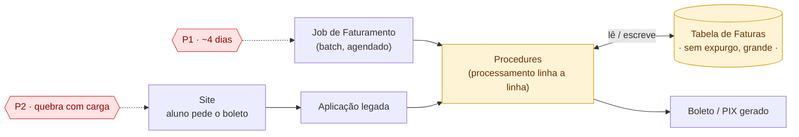

# Arquitetura atual — componentes técnicos

> Recriado após o reset de 27/09. Reflete só o que foi validado nesta rodada:
> P1 (processamento em lote) e P2 (leitura sob demanda), mesma causa raiz.

## Componentes

| Componente | Papel | Problema que causa/sofre |
|---|---|---|
| **Job de Faturamento** | Batch agendado, dispara o processamento de todas as faturas do ciclo | Gera o **P1** — demora ~4 dias |
| **Site** | Onde o aluno pede o boleto | Sofre o **P2** — trava com muito acesso |
| **Aplicação legada** | Recebe o pedido do site, aciona as procedures | — |
| **Procedures** (destacado) | Processamento linha a linha (RBAR) — usado tanto pelo job quanto pelo pedido sob demanda | Raiz técnica do **P1b** |
| **Tabela de Faturas** (destacado) | Tabela principal, sem processo de expurgo, cresceu muito | Raiz técnica do **P1a** e do **P2** |
| **Boleto/PIX gerado** | Resultado devolvido ao aluno | — |

## A leitura central deste diagrama

**Job** e **Site** são duas portas de entrada diferentes, mas convergem nas
**mesmas** Procedures e na **mesma** tabela. É por isso que P1 e P2, apesar de
sentidos de formas diferentes (um é lento uma vez por ciclo, o outro trava sob
concorrência), têm a mesma causa técnica de fundo.

A arquitetura proposta (6 movimentos, já validada em conversa, ainda não
desenhada) ataca essas duas caixas destacadas: as Procedures viram
processamento paralelo fora do banco (Competing Consumers), e a Tabela ganha
particionamento/expurgo em paralelo, fora do escopo de EDA.
