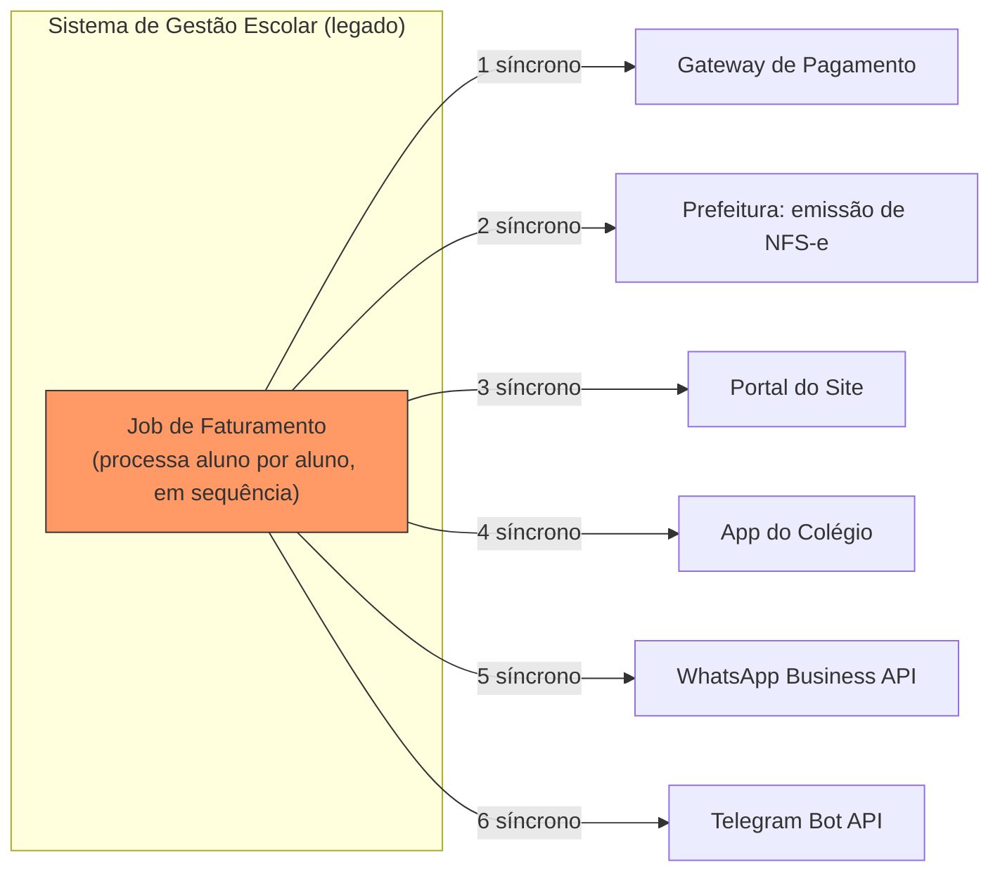
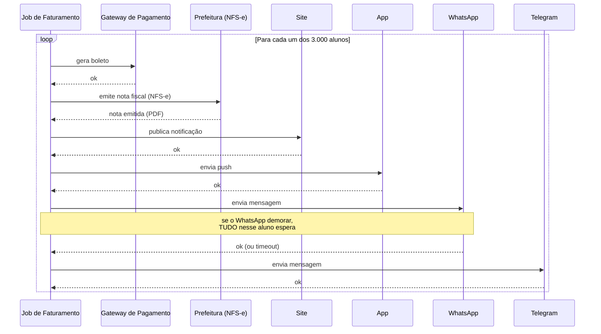

# Arquitetura atual (síncrona) — Colégio Leal

Contexto: 3.000 alunos matriculados, mensalidade vencendo todo dia 5.

## Visão estrutural — quem fala com quem

## Visão temporal — por que trava

## Problemas que essa arquitetura expõe

- **Cadeia bloqueante**: 6 chamadas síncronas em sequência, por aluno, multiplicadas por 3.000.
- **Acoplamento forte**: o job de faturamento (legado) precisa conhecer a API de todo mundo. Adicionar um canal novo significa mexer no código legado.
- **Sem isolamento de falha**: se o WhatsApp cai, os alunos que ainda não foram processados ficam sem NADA (nem site, nem app, nem Telegram), porque a cadeia trava.
- **Janela de tempo em risco**: o job precisa terminar antes de um horário (ex.: antes das 6h). Qualquer lentidão externa ameaça essa janela.

_Status: rascunho v1, gerado em colaboração com o Claude em 2026-09-26 — ajustar números/labels à vontade._
