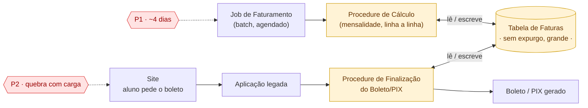

# Arquitetura atual — componentes técnicos

> Recriado após o reset de 27/09. Reflete só o que foi validado nesta rodada:
> P1 (processamento em lote) e P2 (leitura sob demanda), mesma causa raiz —
> a tabela. **Correção importante (27/09): não são a mesma procedure.** São
> duas procedures diferentes, que fazem coisas diferentes, e só têm em comum
> baterem na mesma tabela.

## Componentes

| Componente | Papel | Problema que causa/sofre |
|---|---|---|
| **Job de Faturamento** | Batch agendado, dispara o processamento de todas as faturas do ciclo | Gera o **P1** — demora ~4 dias |
| **Site** | Onde o aluno pede o boleto | Sofre o **P2** — trava com muito acesso |
| **Aplicação legada** | Recebe o pedido do site, aciona a procedure de finalização | — |
| **Procedure de Cálculo** (destacado) | Calcula a mensalidade (matérias, dependências, taxas), linha a linha (RBAR). Chamada só pelo Job, uma vez por ciclo | Raiz técnica do **P1b** |
| **Procedure de Finalização do Boleto/PIX** (destacado) | Monta o boleto/PIX a partir do que já foi calculado. Chamada pelo Site, uma vez por pedido do aluno | Raiz técnica do **P2** |
| **Tabela de Faturas** (destacado) | Tabela principal, sem processo de expurgo, cresceu muito — usada pelas **duas** procedures | Raiz técnica do **P1a** e agravante do **P2** |
| **Boleto/PIX gerado** | Resultado devolvido ao aluno | — |

## A leitura central deste diagrama

**Job** e **Site** disparam **procedures diferentes**, com propósitos
diferentes: uma calcula a mensalidade, a outra finaliza o documento de
cobrança. O que as duas têm em comum é baterem na **mesma tabela**, sem
expurgo. É por isso que P1 e P2, apesar de serem sentidos de formas
diferentes (um é lento uma vez por ciclo, o outro trava sob concorrência),
compartilham a mesma causa técnica de fundo — a tabela, não a procedure.

A arquitetura proposta (6 movimentos, já validada em conversa) ataca as três
caixas destacadas: a Procedure de Cálculo vira processamento paralelo fora do
laço serial (Competing Consumers), a Procedure de Finalização passa a rodar
uma vez por evento em vez de uma vez por clique, e a Tabela ganha
particionamento/expurgo em paralelo, fora do escopo de EDA.
