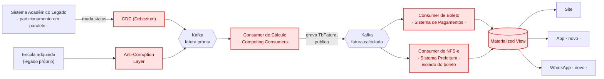

# Arquitetura proposta — componentes novos

> Resolve P1 e P2 (ver `01-arquitetura-atual.md`), já preparada pra P3 (canais)
> e P4 (aquisição). Componentes novos destacados em vermelho.
>
> **Decisão (confirmada com o usuário):** boleto e NFS-e viram **consumers
> separados**. Hoje (arquitetura atual) uma falha na Prefeitura derruba o
> boleto que já tinha ficado pronto — isso não pode sobreviver na proposta.
> Isolar os dois é o que resolve o P2 de verdade, não só troca o gatilho de
> síncrono pra assíncrono.

## Componentes novos (vermelho)

| Componente | Papel | Resolve |
|---|---|---|
| **CDC (Debezium)** | Observa o legado, dispara o evento sozinho, sem tocar em código | Gatilho autônomo |
| **Kafka `fatura.pronta`** | Sinaliza que dá pra calcular. 2 origens: legado próprio + escola adquirida | Backbone do desacoplamento |
| **Consumer de Cálculo** | N instâncias (Competing Consumers), cada uma roda `CalculaFatura` pra 1 aluno, grava `TbFatura`, publica `fatura.calculada` | **P1b** (fim do RBAR como gargalo) |
| **Kafka `fatura.calculada`** | Sinaliza que a fatura já está pronta pra virar boleto/nota | Desacopla cálculo de finalização |
| **Consumer de Boleto** | Lê `fatura.calculada`, chama o Sistema de Pagamentos, gera o boleto | Metade do **P2** |
| **Consumer de NFS-e** | Lê `fatura.calculada`, chama a Prefeitura, emite a nota — **independente** do Consumer de Boleto | Outra metade do **P2**, e a causa nova: **isola a falha da Prefeitura do boleto** |
| **Materialized View** | Guarda boleto e NFS-e prontos, cada um podendo estar em estado diferente (boleto pronto, nota ainda pendente) | Site nunca mais aciona a procedure/tabela na hora |
| **App / WhatsApp** | Só leem a Materialized View | **P3** |
| **Anti-Corruption Layer** | Traduz o formato da escola adquirida pro mesmo evento `fatura.pronta` | **P4** |

## O que muda de verdade com a separação

Na arquitetura atual, se a Prefeitura cai, o boleto que já tinha sido gerado
é descartado — um problema que não tem nada a ver com o governo quebra por
causa dele. Com os dois consumers separados, esse cenário muda: o **Consumer
de Boleto** publica seu resultado independente do que acontecer com o
**Consumer de NFS-e**. Se a Prefeitura cair, o aluno já recebe o boleto; a
nota fica pendente, tentando de novo (retry, post 5), sem travar nada que já
funcionou.

## O que fica de fora deste diagrama, de propósito

- **Particionamento/expurgo da tabela** — necessário em paralelo, mas é
  faxina de banco de dados, não um componente de evento. Sem isso, mesmo os
  Consumers em paralelo continuam disputando uma tabela lenta.
- **Por que CDC e não Outbox** — o legado já marca internamente quando uma
  fatura fica pronta; o CDC observa essa mudança de status que já existe, sem
  precisar de nenhuma alteração de código. Outbox fica como alternativa se a
  granularidade do CDC se mostrar barulhenta na prática.
