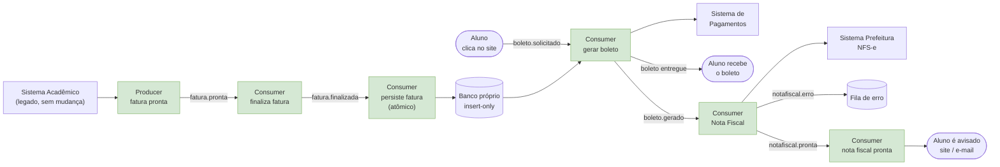

# Arquitetura proposta — visão geral

> Resolve P1 e P2 (ver `01-arquitetura-atual.md`). Nomes de componente no
> nível de vocabulário de EDA (Producer/Consumer) — os nomes concretos de
> tecnologia (Job Verifica Fatura, Orquestrador Central, Atom persiste
> Fatura etc.) aparecem a partir do post 2, conforme a implementação real
> for sendo construída. Fonte de verdade da arquitetura completa, com os
> nomes concretos: `arquitetura-atual.drawio`.

## Componentes novos (verde)

| Componente | Papel | Resolve |
|---|---|---|
| **Producer — fatura pronta** | Lê a `TbFatura` periodicamente (polling, 30min — CDC/Debezium fica documentado como evolução futura) e publica `fatura.pronta` por aluno | Gatilho autônomo, sem mudar o legado |
| **Consumer finaliza fatura** | Aciona só o pedaço de cálculo final da `GeraFaturaFinal` de forma proativa, durante a janela de processamento — publica `fatura.finalizada` | Tira a finalização do clique do usuário |
| **Consumer persiste fatura (atômico)** | Ouve `fatura.finalizada`, grava insert-only num banco próprio (não o do legado) | Leitura rápida + histórico completo pra auditoria |
| **Consumer gerar boleto** | Dispara no clique do aluno (`boleto.solicitado`), consulta o banco próprio, chama o Sistema de Pagamentos, publica `boleto.gerado` | Metade do **P2** — geração isolada do resto |
| **Consumer Nota Fiscal** | Ouve `boleto.gerado` **em paralelo**, chama a Prefeitura com retry, publica `notafiscal.pronta`/`notafiscal.erro` — não bloqueia o retorno do boleto | A outra metade do **P2**: isola a falha da Prefeitura do boleto |
| **Consumer nota fiscal pronta** | Ouve `notafiscal.pronta`, avisa o aluno (site/e-mail) | Fecha o ciclo sem o aluno precisar ficar checando |

## O que muda de verdade com a separação

Na arquitetura atual, se a Prefeitura cai, o boleto que já tinha sido
gerado é descartado — um problema que não tem nada a ver com o governo
quebra por causa dele. Com o Consumer de boleto e o Consumer de Nota
Fiscal como dois consumidores independentes do mesmo evento
`boleto.gerado`, esse cenário muda: o boleto já foi entregue ao aluno
antes mesmo da Prefeitura ser chamada. Se ela cair, a nota fica pendente,
tentando de novo (retry, post 4), sem travar nada que já funcionou.

## O que fica de fora deste diagrama, de propósito

- **Particionamento/expurgo da tabela** — necessário em paralelo, mas é
  faxina de banco de dados, não um componente de evento.
- **Por que polling e não CDC** — polling não exige nenhuma permissão
  especial no banco (só uma conexão de leitura comum), enquanto CDC/Debezium
  exige acesso de replicação, que nem toda empresa concede de primeira.
  Aceita até 30 minutos de atraso em troca de simplicidade — documentado
  como Solução A no post 1, com CDC como Solução B/evolução futura (post 8).
