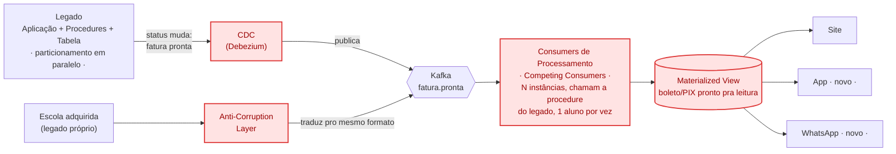

# Arquitetura proposta — componentes novos

> Resolve P1 e P2 (ver `01-arquitetura-atual.md`), já preparada pra P3 (canais)
> e P4 (aquisição). Componentes novos destacados em vermelho.

## Componentes novos (vermelho)

| Componente | Papel | Resolve |
|---|---|---|
| **CDC (Debezium)** | Observa o legado (log de transação), dispara o evento sozinho, sem tocar em código | Gatilho autônomo |
| **Kafka** | Transporta o sinal `fatura.pronta`, de 2 origens (legado próprio + escola adquirida) | Backbone do desacoplamento |
| **Consumers de Processamento** | N instâncias, cada uma chama a mesma procedure do legado, mas 1 aluno por vez, em paralelo — não é mais um laço só, serial | **P1b** (fim do RBAR como gargalo) |
| **Materialized View** | Guarda o boleto/PIX já pronto | **P2** (site nunca mais recalcula na hora) |
| **App / WhatsApp** | Só leem a Materialized View — chegam de graça, sem tocar em nada existente | **P3** |
| **Anti-Corruption Layer** | Traduz o formato da escola adquirida pro mesmo evento `fatura.pronta` | **P4** |

## O que fica de fora deste diagrama, de propósito

- **Particionamento/expurgo da tabela** — necessário em paralelo (nota no
  card do Legado), mas é faxina de banco de dados, não um componente de
  evento. Sem isso, mesmo os Consumers em paralelo continuam disputando uma
  tabela lenta.
- **Por que CDC e não Outbox** — o legado já marca internamente quando uma
  fatura fica pronta; o CDC observa essa mudança de status que já existe, sem
  precisar de nenhuma alteração de código. Outbox fica como alternativa se a
  granularidade do CDC se mostrar barulhenta na prática.
