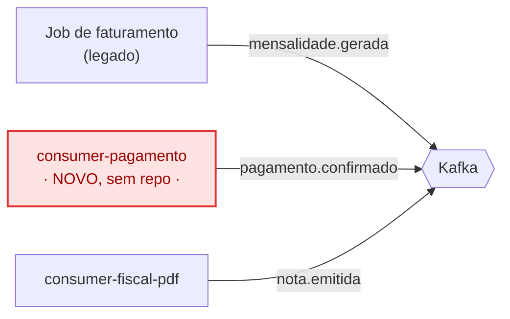
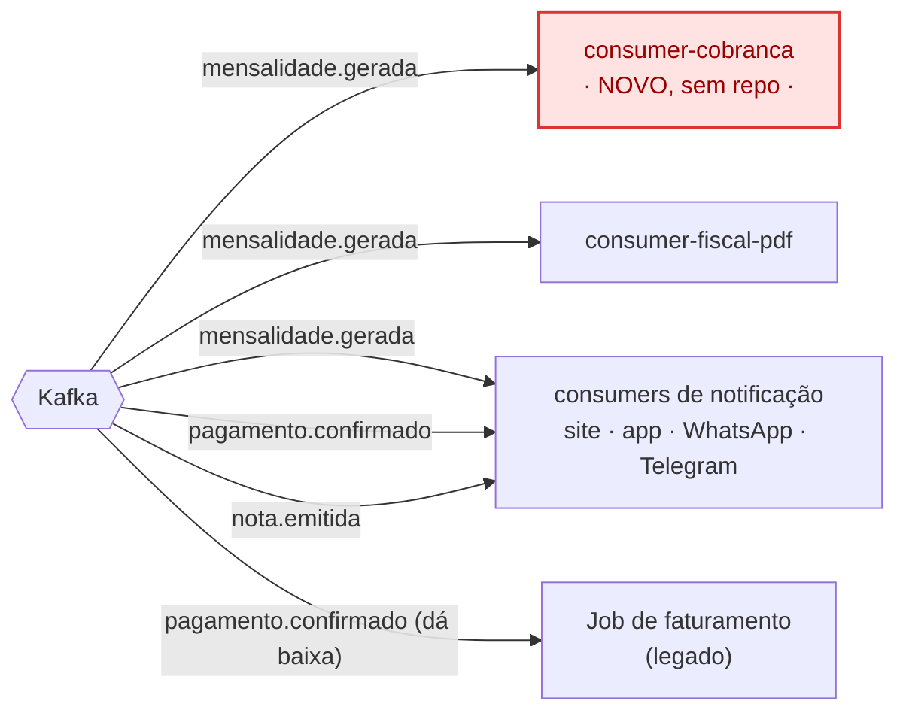

# Arquitetura proposta (com eventos) — Faculdade Leal

Resposta direta à pergunta "isso tudo continua no legado?": **não**. O legado
(Acadêmico + Cálculo + Job de faturamento) continua existindo e continua dono
do cálculo (ver [ADR-001](../decisoes/adr-001-nao-migrar-legado-para-microsservicos.md)),
mas passa a só **publicar fatos**. Quem faz cobrança, nota fiscal e avisos são
serviços próprios, cada um no seu repositório.

**2 componentes ainda não têm repo criado** — aparecem em vermelho abaixo:
- **`consumer-cobranca`**: cria boleto, PIX e cartão a partir de `mensalidade.gerada`.
- **`consumer-pagamento`**: recebe o webhook do banco/PSP quando o aluno paga e
  publica `pagamento.confirmado` — é este componente que resolve o **P3**
  (substitui o job de conciliação em lote por uma reação em tempo real).

## 1. Quem publica (produtores → Kafka)

## 2. Quem consome (Kafka → consumidores)

Repare: o legado aparece nos dois diagramas — publica `mensalidade.gerada` e
também **consome** `pagamento.confirmado`, pra dar baixa. Ele deixou de sair
perguntando (conciliação em lote) e passou a ser avisado.

## 3. Quem chama qual terceiro (sem mudança de conceito, só de dono)

| Serviço | Terceiro | Como |
|---|---|---|
| `consumer-cobranca` | Banco, PSP (PIX), gateway de cartão | chamada síncrona, isolada nesse serviço |
| `consumer-fiscal-pdf` | Prefeitura (NFS-e) | chamada síncrona, isolada nesse serviço (resolve o **P2**: se travar, só a nota atrasa) |
| `consumer-pagamento` | Banco / PSP | **recebe** (webhook), não chama — é o banco quem avisa |
| `consumers de notificação` | WhatsApp Business API, Telegram Bot API | chamada síncrona por canal |

## 4. Onde cada PX se resolve

| # | Problema | Resolvido por |
|---|---|---|
| P1 | Não fecha em 1 dia | Publicar e seguir (legado) + processamento paralelo em cada consumer |
| P2 | Nota fiscal trava o resto | `consumer-fiscal-pdf` isolado — prefeitura lenta não afeta mais ninguém |
| P3 | PIX pago, ainda em aberto | `consumer-pagamento` (webhook → evento), elimina a conciliação em lote |
| P4 | Correção não se espalha | Secretaria ajusta → legado publica `mensalidade.alterada` (mesmo formato de `mensalidade.gerada`) → os mesmos consumers reagem de novo, sem código novo |

> `mensalidade.alterada` ainda não apareceu nos diagramas acima — é o evento
> que o post 4 (ou um ajuste deste arquivo) formaliza pro P4.

## Repositórios — o que falta

| Repositório | Status |
|---|---|
| `legado-faculdade-leal` | existe |
| `consumer-fiscal-pdf` | existe |
| `consumer-notif-site` / `-app` / `-whatsapp` / `-telegram` | existem |
| **`consumer-cobranca`** | **não existe — criar** |
| **`consumer-pagamento`** | **não existe — criar** |
