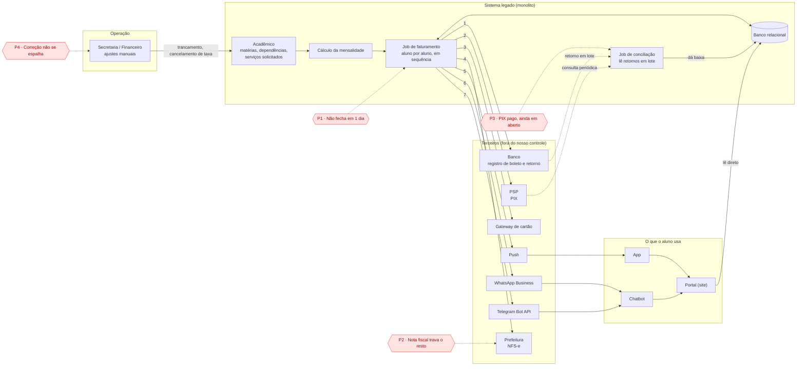
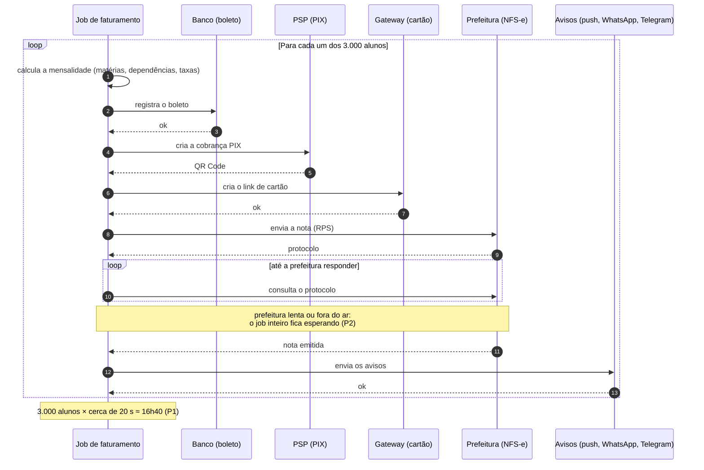
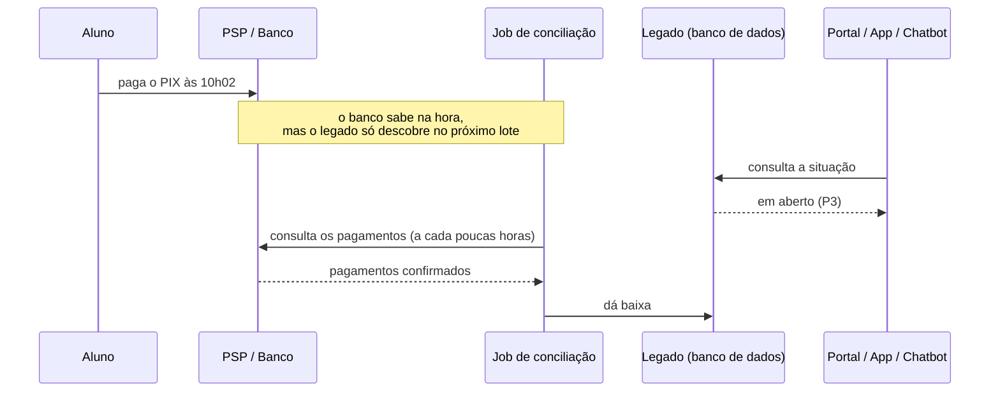
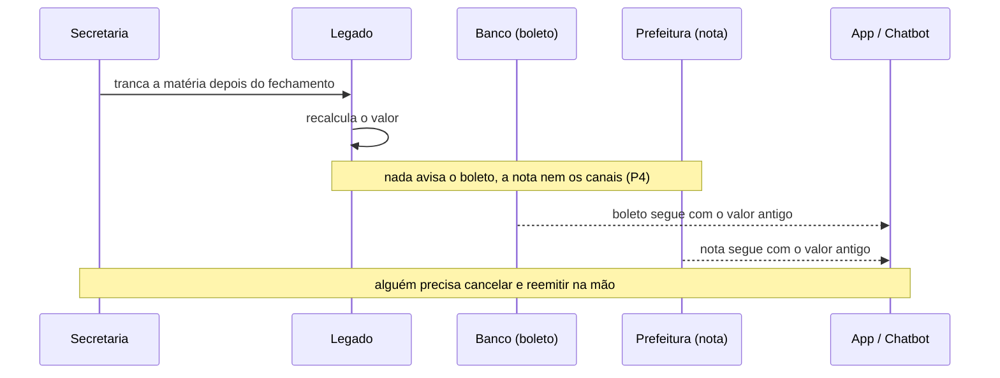

# Fluxo atual (como é hoje) — versão mais realista

> Rascunho de referência pra você redesenhar no draw.io. As premissas abaixo são
> do case (fictício): ajuste conforme a realidade que você viu, sem citar nomes.

## Os 4 problemas escolhidos (P1 a P4)
| # | Problema do aluno / da faculdade | Benefício da EDA que resolve |
|---|---|---|
| P1 | O faturamento não fecha em 1 dia | Escala e paralelismo |
| P2 | A nota fiscal (prefeitura) trava todo o resto | Isolamento de falha |
| P3 | Paguei o PIX e continua "em aberto" | Reação em tempo real (evento em vez de lote) |
| P4 | Ajustaram minha matrícula, mas boleto, nota e app seguem velhos | Propagação de mudança |

## 1. Visão estrutural — quem fala com quem

As setas 1 a 7 são chamadas **síncronas, em sequência**, feitas pelo job, aluno
por aluno.

## 2. Visão temporal — a virada de mês (P1 e P2)

## 3. Visão do dia a dia (P3 e P4)

**P3 — PIX pago, sistema "em aberto"**

**P4 — ajuste manual que não se espalha**

## Premissas do case (ajuste conforme a realidade que você viu)
- Cobrança e nota fiscal por aluno, todo mês.
- Cerca de 20 s por aluno somando todas as chamadas externas (boleto, PIX, cartão,
  prefeitura, avisos) — número fictício, serve pra conta do P1.
- A conciliação de pagamentos roda em lote, a cada poucas horas, a partir do
  retorno do banco e da consulta ao PSP.
- O portal lê direto do banco do legado; app e chatbot consultam o portal.
- Ajuste manual da secretaria não dispara nenhuma ação automática nos terceiros.
