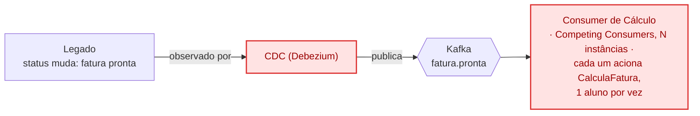

# Post 2 — CDC dispara, cálculo roda em paralelo

Primeira fatia da arquitetura proposta (`02-arquitetura-proposta.md`): só o
gatilho autônomo (CDC) e o paralelismo de `CalculaFatura`. Ainda sem
Consumer de Boleto/NFS-e, Materialized View ou canais novos — isso vem no
post 3.
