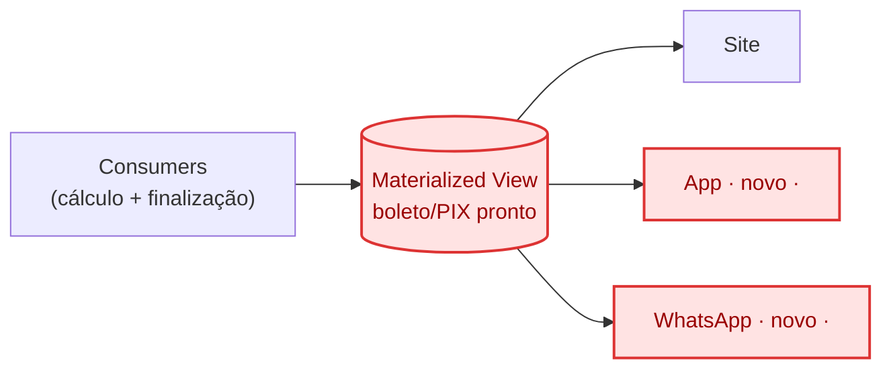

# Post 3 — Finalização proativa + fan-out de leitura

Segunda fatia: o mesmo consumer do post 2 passa a acionar também a Procedure
de Finalização (proativamente, uma vez por fatura), grava o resultado numa
Materialized View, e três canais independentes passam a ler dali.
