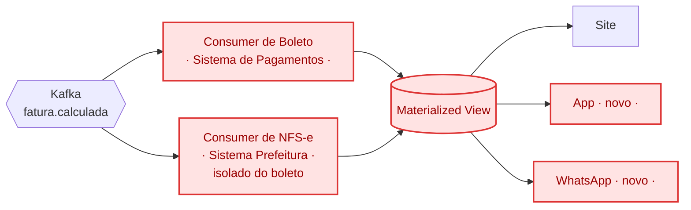

# Post 3 — Boleto e NFS-e isolados, fan-out de leitura

Segunda fatia: `GeraFaturaFinal` deixa de ser um bloco só e vira dois
consumers independentes — Boleto e NFS-e, cada um falando só com o terceiro
dele. Os dois gravam na Materialized View, e três canais (site, app,
WhatsApp) passam a só ler.
