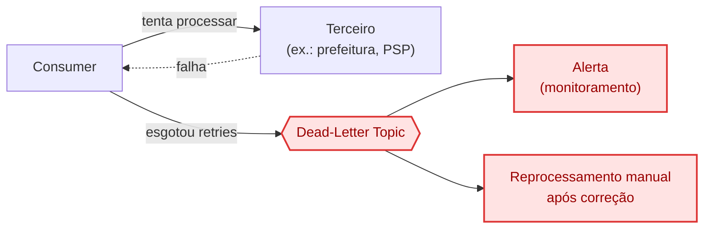

# Post 6 — Dead-letter

```mermaid
flowchart LR
    CONS["Consumer"] -->|"tenta processar"| EXT["Terceiro<br/>(ex.: prefeitura, PSP)"]
    EXT -.->|"falha"| CONS
    CONS -->|"esgotou retries"| DLT{{"Dead-Letter Topic"}}
    DLT --> ALERTA["Alerta<br/>(monitoramento)"]
    DLT --> REPRO["Reprocessamento manual<br/>após correção"]

    classDef novo fill:#ffe3e3,stroke:#d33,color:#900,stroke-width:2px
    class DLT,ALERTA,REPRO novo
```
